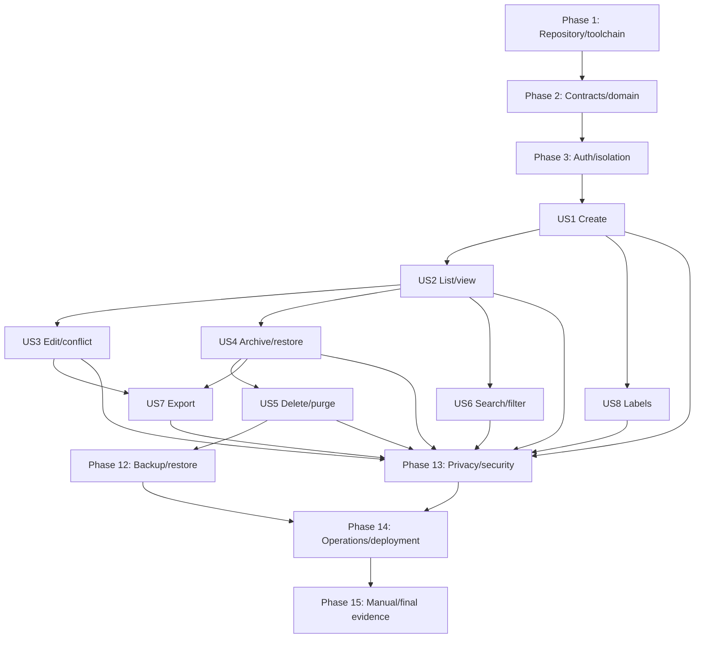

# Tasks: Money Memo Foundation

**Feature**: `001-money-memo-foundation`  
**Authoritative inputs**: Cashmemo constitution; all Feature 001 specification, planning, contract,
operations, test, compliance, exception, and checklist artifacts listed in task-generation request.  
**Required gate order**: formatting/linting, type checking, unit tests, real integration tests,
privacy tests, acceptance evidence.  
**Governance**: Constitution exception C-07 is explicit. Tasks must never claim complete semantic
detection. C-07 controls, accepted risks, owners, reviews, evidence, annual review, and removal plan
remain release-visible.

## Checklist format

Every task uses required checkbox, sequential task ID, optional `[P]`, optional story label, action,
and exact target path. `[P]` means different target files and no dependency on another unfinished
task in same parallel set. Story labels appear only in user story phases.

## Phase 1: Repository and toolchain foundation

**Purpose**: Create pinned monorepo, strict build configuration, and executable gate surface.

- [X] T001 Create repository ignore rules for Node, Rust, Playwright, Dexie test data, local secrets, backup artifacts, and evidence scratch files in `.gitignore`
- [X] T002 Configure pinned Rust 1.97.1/Rust 2024 toolchain, rustfmt/import policy, and dependency/license/advisory bans for MongoDB, Redis, AI/STT, and direct database drivers in `rust-toolchain.toml`, `rustfmt.toml`, and `deny.toml`
- [X] T003 Create Rust modular-monolith workspace members, shared dependency pins, and initial one-binary crate manifest in `backend/Cargo.toml` and `backend/crates/cashmemo/Cargo.toml`
- [X] T004 Configure the Node 24 npm workspace and Next.js 16.2.11 strict web toolchain, dependencies, TypeScript rules, and lint bans in `package.json`, `apps/web/package.json`, `apps/web/tsconfig.json`, and `apps/web/eslint.config.mjs`
- [X] T005 Create required `just` command interface from quickstart, including ordered quality gates and evidence directories, in `./justfile`
- [ ] T006 [P] Define runtime configuration names, types, required/secret flags, and fail-closed validation without example secret values in `config/env.schema.json`
- [ ] T007 [P] Create CI workflow enforcing gate order, contract/schema checks, secret scan, architecture scan, and artifact retention in `.github/workflows/ci.yml`
- [X] T008 Create the web presentation/PWA foundation with Tailwind theme, accessible focus/privacy tokens, root App Router shell, shadcn/ui aliases, standalone headers, no-cache API behavior, and service-worker build integration in `apps/web/src/app/globals.css`, `apps/web/src/app/layout.tsx`, `apps/web/components.json`, and `apps/web/next.config.ts`
- [X] T009 Create pinned local-stack service skeleton for Appwrite 1.9.6, web, backend, suppression store, OTel Collector, and OpenObserve in `infra/compose/docker-compose.yml`
- [X] T010 [P] Document architecture boundaries, excluded scope, constitution precedence, C-07 status, and local commands in `README.md`
- [X] T011 Create repository-layout and forbidden-dependency smoke test in `tests/architecture/repository_layout_test.sh`
- [X] T012 Create the release-blocking C-07 control register with mitigation-to-task trace, Product/Security/feature-owner RACI, material-change triggers, annual cadence, accepted risk, and removal conditions in `docs/governance/c07-control-register.md`
- [X] T013 Implement cryptographically random local secret bootstrap with restrictive permissions, separate fingerprint/KEK/cursor/token keys, and no terminal output in `scripts/secrets/dev-init.sh`
- [ ] T014 Add committed-secret, high-entropy, forbidden-example, and runtime-key separation scans to the quality gate in `scripts/secrets/scan.sh`
- [X] T015 Run Phase 1 smoke/build checks and record command, versions, results, and artifact links in `docs/evidence/001/phase-01-foundation.md`

**Checkpoint**: Pinned repository builds empty web/backend shells and exposes ordered gate commands.

---

## Phase 2: Shared contracts and domain types

**Purpose**: Establish authoritative schemas, domain values, ports, clock, and Appwrite schema before feature behavior.

- [ ] T016 Implement the authoritative OpenAPI 3.1 and export JSON Schema 2020-12 validation suite, including canonical time/offset rules, required conditional `purgeDeadline`, generated/verified scale-specific decimal branches from the currency contract, breaking-change, MIME, trailing-newline, and `additionalProperties` checks, in `scripts/contracts/validate-openapi.mjs` and `scripts/contracts/validate-export-schema.mjs`
- [X] T017 Generate strict TypeScript request/response/error types from OpenAPI including `expectedResultSetVersion`, required conditional `purgeDeadline`, and `PRIVACY_INPUT_REJECTED` safe detector IDs without owner fields in `apps/web/src/lib/api/generated.ts`
- [ ] T018 Create Axum HTTP adapter crate and generate or hand-bind reviewed Rust DTOs matching OpenAPI canonical time, result-set version, purge-deadline, and privacy-error contracts exactly in `backend/crates/http-adapter/Cargo.toml` and `backend/crates/http-adapter/src/contracts/generated.rs`
- [X] T019 Implement the pinned SIX XML checksum/extraction generator with duplicate-scale disagreement failure and commit its code-sorted immutable registry in `scripts/currencies/build-registry.mjs` and `shared/currencies/iso4217-list-one-2026-01-01.json`
- [X] T020 Create registry checksum, exclusion, ordering, scale, and update-policy contract tests in `tests/contracts/currency_registry.test.mjs`
- [ ] T021 Create the dependency-free domain kernel with crate boundary, canonical identifiers/principal/revision/timestamp value types, and explicit redacted domain errors including stable HTTP-422 `PRIVACY_INPUT_REJECTED` in `backend/crates/domain/Cargo.toml`, `backend/crates/domain/src/identifiers.rs`, and `backend/crates/domain/src/error.rs`
- [X] T022 [P] Implement exact minor-unit money, currency scale, canonical decimal parsing/rendering, limits, and no-rounding rules in `backend/crates/domain/src/money.rs`
- [X] T023 [P] Implement occurrence instant/local wall/local date/offset types, canonical six-digit-UTC serialization, exact ±14:00 boundary validation, ±10-year validation, DST ambiguity/gap rules, and recorded/current-zone projections in `backend/crates/domain/src/occurrence.rs`
- [X] T024 [P] Implement active, archived, pending-deletion, derived-expired, and purged lifecycle semantics in `backend/crates/domain/src/lifecycle.rs`
- [X] T025 [P] Implement Category/Money Space typed label identity, state, normalized-name contract, reference count, and revision in `backend/crates/domain/src/label.rs`
- [X] T026 Compose immutable/internal and editable Money Memo fields into aggregate invariants, including required-nullable `purgeDeadline` mapping by lifecycle, in `backend/crates/domain/src/money_memo.rs`
- [X] T027 [P] Define Pattern Set outcome, safe HTTP-422 privacy error with field/rule and optional published B1–B9 identifier allowlist, and C-07 trace metadata types without candidate/derivative storage in `backend/crates/domain/src/privacy.rs`
- [X] T028 Create the inward-only application foundation with crate boundary, owner-scoped repository/unit-of-work/export/suppression/backup/keyring/telemetry ports, and injectable production/manual clock in `backend/crates/application/Cargo.toml`, `backend/crates/application/src/ports.rs`, and `backend/crates/application/src/clock.rs`
- [ ] T029 Implement audited mapping between HTTP DTOs and domain types with unknown/immutable field rejection, canonical time/offset conversion, lifecycle-conditional purge deadline, result-set version, and safe privacy-error mapping in `backend/crates/http-adapter/src/contracts/mapping.rs`
- [X] T030 Create architecture tests forbidding domain imports from Axum, Appwrite, browser, storage, telemetry, AI/STT, Redis, and MongoDB packages in `tests/architecture/domain_boundaries.rs`
- [X] T031 [P] Write money property tests for exact maximums, scales 0–4, malformed decimal forms, and no rounding in `backend/crates/domain/tests/money_properties.rs`
- [X] T032 [P] Write occurrence tests for instant/wall/offset identity, canonical six-digit UTC, valid ±14:00 and invalid ±14:01..±14:59, mixed-offset local-date filtering, DST ambiguity/gaps, and device-zone changes in `backend/crates/domain/tests/occurrence_properties.rs`
- [ ] T033 [P] Write lifecycle state-machine tests including exact deadline boundary and forbidden transitions in `backend/crates/domain/tests/lifecycle_properties.rs`
- [ ] T034 [P] Write stable error-code, HTTP mapping, safe detector-ID allowlist, canonical time, conditional purge-deadline, and value/derivative-redaction contract tests in `backend/crates/http-adapter/tests/error_contract.rs`
- [X] T035 Define and idempotently provision backend-private Money Memo, label, and journal-state TablesDB columns including base and query-dimension result generations, permissions, limits, and indexes through supported Appwrite APIs with index-availability polling in `infra/appwrite/schema.json` and `infra/appwrite/provision.ts`
- [X] T036 Create real Appwrite schema/index/limit/cache/transaction capability tests in `tests/integration-appwrite/schema_contract.rs`
- [X] T037 Run contract, domain, architecture, currency, and real schema gates and record results in `docs/evidence/001/phase-02-contracts-domain.md`

**Checkpoint**: Contracts validate, domain compiles without outward dependencies, and real Appwrite schema is provisioned only through supported APIs.

---

## Phase 3: Authentication and user-isolation foundation

**Purpose**: Establish fail-closed Appwrite SSR authentication and owner scoping before any story endpoint.

### Tests first

- [X] T038 [P] Write failing session-cookie, expired/revoked session, Account API failure, and no-owner-field HTTP tests in `backend/crates/http-adapter/tests/auth_contract.rs`
- [X] T039 [P] Write failing repository tests proving every targeted/list mutation requires explicit authenticated owner scope in `tests/integration-appwrite/owner_scope_contract.rs`
- [X] T040 [P] Write failing indistinguishable unknown/other-owner response and timing-envelope tests in `tests/integration-appwrite/not_found_isolation.rs`

### Implementation

- [ ] T041 Create the supported-API Appwrite adapter boundary and REST/GraphQL client with `ttl=0`, transaction support, POST-body queries, bounded retries, and redacted errors in `backend/crates/appwrite-adapter/Cargo.toml` and `backend/crates/appwrite-adapter/src/client.rs`
- [X] T042 Implement the fail-closed Appwrite Account session authentication pipeline from opaque SSR cookie through principal-only Axum extractor, never accepting owner input from requests, in `backend/crates/appwrite-adapter/src/auth.rs` and `backend/crates/http-adapter/src/auth.rs`
- [X] T043 Define repository method signatures that require `AuthenticatedOwner` for all user operations and separate narrow worker/reconcile capabilities in `backend/crates/application/src/authorization.rs`
- [X] T044 Implement owner predicates for targeted and list Money Memo persistence operations in `backend/crates/appwrite-adapter/src/money_memo_repository.rs`
- [X] T045 Implement owner predicates for label reads, references, and mutations in `backend/crates/appwrite-adapter/src/label_repository.rs`
- [X] T046 Implement deterministic private journal-state row lookup, base/query-dimension generation reads/updates, and owner-scoped transaction participation in `backend/crates/appwrite-adapter/src/journal_state_repository.rs`
- [X] T047 Apply deny-by-default TablesDB permissions and scoped backend credential policy in `infra/appwrite/schema.json`
- [X] T048 Build Axum router shell and `serve` binary wiring with authentication, explicit JSON limits, stable problem responses, `Cache-Control: no-store`, and no request-body logging in `backend/crates/http-adapter/src/router.rs` and `backend/crates/cashmemo/src/main.rs`
- [ ] T049 Implement the web authentication/server-state foundation with account-switch cleanup, non-persisted TanStack Query provider, and typed credentialed API client with no owner or URL search values in `apps/web/src/lib/auth/session.ts`, `apps/web/src/lib/query/query-provider.tsx`, and `apps/web/src/lib/api/client.ts`
- [X] T050 Execute real Appwrite cross-user authentication matrix for read/list/mutation scaffolding in `tests/integration-appwrite/auth_isolation.rs`
- [X] T051 Prove unauthenticated browser and user session cannot access TablesDB directly in `tests/integration-appwrite/direct_tablesdb_denial.rs`
- [X] T052 Implement idempotent per-owner starter Category and Money Space seeding required before compose becomes usable in `backend/crates/application/src/use_cases/seed_labels.rs`
- [X] T053 Implement the owner-scoped active-label reference query use case and endpoint required by compose in `backend/crates/application/src/use_cases/query_label_references.rs` and `backend/crates/http-adapter/src/routes/label_reference.rs`
- [X] T054 Create the shared synthetic privacy canary corpus for amounts, notes, labels, searches, fingerprints, keys, cursors, tokens, auth, exports, Pattern Set candidates, and raw/escaped/URL/base64/hash derivatives in `tests/privacy/fixtures/canaries.json`
- [X] T055 Implement shared scanner that permits published safe detector ID only in HTTP-422 field error, rejects it from diagnostics/evidence, and rejects candidate/raw/normalized/match derivatives across browser/backend/proxy/Appwrite/container logs, HTTP errors, OTLP, OpenObserve, crash reports, and evidence in `tests/privacy/scan_captures.ts`
- [ ] T056 Run the authentication/isolation gate plus shared privacy-canary scanner self-test and store zero-disclosure evidence in `docs/evidence/001/phase-03-auth-isolation.md`

**Checkpoint**: All protected paths derive owner from Appwrite session; unknown and other-owner resources are indistinguishable.

---

## Phase 4: US1 — Create Money Memo (Priority: P1) — US1 vertical milestone

**Goal**: Create one confirmed exact Money Memo with durable retry identity, immutable keyed fingerprint, recoverable local draft, and C-07 controls.

**Independent test**: `just acceptance us1-create` creates exact valid memo; aggregates invalid errors; exercises 1,000 retries, retry after edit/lifecycle change, creation conflict, different compose IDs, Pattern Set behavior, key failure/rotation, and draft recovery.

### Tests first

- [X] T057 [P] [US1] Write failing create validation tests for required fields, positive bounded exact money, currency registry, note length, occurrence range, labels, and aggregated safe errors in `backend/crates/domain/tests/create_validation.rs`
- [X] T058 [P] [US1] Write failing RFC 8785 canonical fingerprint golden/property vectors across field order, decimals, Unicode, null note, references, and offsets in `backend/crates/domain/tests/creation_fingerprint.rs`
- [X] T059 [P] [US1] Write failing per-memo key generation, AEAD wrap/rewrap, constant-time compare, missing-key fail-closed, rotation, and offline-dictionary resistance tests in `backend/crates/application/tests/fingerprint_key_lifecycle.rs`
- [ ] T060 [P] [US1] Write failing real Appwrite concurrent same-ID/different-ID retry tests including current lifecycle/revision return without write in `tests/integration-appwrite/create_idempotency.rs`
- [ ] T061 [P] [US1] Write failing OpenAPI create/currency endpoint response, HTTP-422 `PRIVACY_INPUT_REJECTED` with safe B1–B9 ID only, candidate/normalized/derivative exclusion, W1–W3 warning-only acceptance, canonical time/offset, conditional purge deadline, validation, conflict, unavailable, and no-store contract tests in `backend/crates/http-adapter/tests/create_contract.rs`
- [ ] T062 [P] [US1] Write failing Dexie partition, stable UUID, reload/retry, success/discard deletion, and account-switch tests in `apps/web/tests/compose-draft.test.ts`
- [ ] T063 [P] [US1] Write failing client Pattern Set B1–B9/W1–W3, adjacent warning, edit/remove/continue, no-network block, and byte-exact input-preservation tests in `apps/web/tests/privacy-pattern-create.test.tsx`
- [X] T064 [US1] Write the failing US1 Playwright create/retry/validation/privacy-warning journey and wire `acceptance us1-create` to only US1 tests plus required contract, authentication, and privacy regressions in `tests/acceptance/us1_create.spec.ts` and `./justfile`

### Implementation

- [X] T065 [P] [US1] Encode exact versioned Pattern Set v1 labels, distances, separators, lengths, checksums, statement thresholds, and safe UI copy in `shared/privacy/pattern-set-v1.json`
- [ ] T066 [US1] Implement deterministic server Pattern Set v1 preprocessing and B1–B9/W1–W3 decisions with ephemeral buffers only in `backend/crates/domain/src/privacy_pattern_v1.rs`
- [ ] T067 [US1] Implement behavior-equivalent client Pattern Set v1 detector without analytics or retained derivatives in `apps/web/src/lib/privacy/pattern-set-v1.ts`
- [X] T068 [US1] Implement canonical creation fingerprint, random 256-bit per-memo MAC key, HMAC-SHA-256, AEAD wrapping, and immutable verification in `backend/crates/application/src/creation_fingerprint.rs`
- [X] T069 [US1] Implement runtime KEK keyring, rewrap-only rotation, escrow identifiers, fail-closed behavior, and retirement checks in `backend/crates/application/src/keyring.rs`
- [ ] T070 [US1] Implement Appwrite create transaction covering export fence/state, base result-generation invalidation, memo, Category/Money Space counts, and unique `(owner_id, creation_id)` race resolution in `backend/crates/appwrite-adapter/src/create_money_memo.rs`
- [X] T071 [US1] Implement create-or-resolve-retry use case invoking server Pattern Set v1, rejecting blocking matches, and returning current lifecycle/revision without modifying or resurrecting matching memo in `backend/crates/application/src/use_cases/create_money_memo.rs`
- [X] T072 [US1] Implement `POST /v1/money-memos` handler and stable HTTP-422 privacy/idempotency/key errors exposing at most safe published detector ID and never candidate content or derivatives in `backend/crates/http-adapter/src/routes/create_money_memo.rs`
- [X] T073 [P] [US1] Implement immutable `GET /v1/reference/currencies` registry service and handler in `backend/crates/http-adapter/src/routes/currencies.rs`
- [ ] T074 [US1] Implement the compose client-state slice: user-partitioned Dexie draft/retry schema, non-persisted Zustand UI state, stable compose UUID, byte-exact autosave, legitimate retry reuse, discard, and success cleanup in `apps/web/src/lib/compose/db.ts`, `apps/web/src/features/money-memos/compose-store.ts`, and `apps/web/src/features/money-memos/use-compose-session.ts`
- [X] T075 [US1] Implement TanStack create/currency/active-label hooks that retain draft on network, conflict, validation, export-fence, and key failure in `apps/web/src/features/money-memos/api.ts`
- [X] T076 [US1] Build the accessible Money Memo create form and aggregated safe validation summary for all supported fields without echoing amount, note, or detector candidates in `apps/web/src/features/money-memos/components/money-memo-form.tsx` and `apps/web/src/features/money-memos/components/validation-summary.tsx`
- [X] T077 [US1] Build adjacent prohibited-data warning and B/W correction UI without complete-detection claims or value echo in `apps/web/src/features/money-memos/components/privacy-warning.tsx`
- [ ] T078 [US1] Assemble authenticated create route with synthetic-safe empty/loading/error states in `apps/web/src/app/(app)/money-memos/new/page.tsx`
- [ ] T079 [US1] Run `just acceptance us1-create` and record commands, environment, requirement mapping, privacy scan, and pass/fail evidence in `docs/evidence/001/us1/acceptance.md`

**Acceptance gate**: T079 must pass before US1 is complete. This is the US1 vertical milestone after Phases 1–3; Feature 001 remains incomplete.

---
## Phase 5: US2 — List and view Money Memos (Priority: P1)

**Goal**: Owner-scoped active/archive list and detail with deterministic compound order, validated encrypted cursor, result-set-version-guarded traversal, and visible mandatory refresh.

**Independent test**: `just acceptance us2-list` traverses 10,000 stable rows exactly once; proves page/request/cursor result-set-version binding; invalidates create/archive/restore/delete/purge/occurrence and current-query membership changes; preserves membership-neutral non-sort edits; rejects malformed/tampered/expired/wrong-owner cursors and page sizes; never returns purged/expired rows; and reveals zero other-user data.

### Tests first

- [ ] T080 [P] [US2] Write failing total-order and version-guarded keyset property tests for stable exactly-once traversal, create/archive/restore/delete/purge/occurrence invalidation, query-membership invalidation, membership-neutral non-sort preservation, and purged/expired exclusion in `backend/crates/domain/tests/pagination_properties.rs`
- [ ] T081 [P] [US2] Write failing cursor golden/tamper/expiry/owner/view/query/page-size/result-set-version/key-rotation validation tests, including request/cursor mismatch and Recently Deleted `membershipValidUntil`, in `backend/crates/application/tests/cursor_contract.rs`
- [ ] T082 [P] [US2] Write failing real Appwrite DNF compound-order, row-anchor independence, `ttl=0`, base/query-dimension generation transaction, pre/post result-set-version read, and page-size tests in `tests/integration-appwrite/pagination_contract.rs`
- [ ] T083 [P] [US2] Write failing cross-user direct-read, list, broad-query, wrong-owner result-set-version/cursor, and indistinguishable not-found tests in `tests/integration-appwrite/us2_isolation.rs`
- [ ] T084 [US2] Write the failing US2 Playwright list/detail/pagination/timezone/refresh journey covering returned/expected result-set version and all mandatory invalidations, and wire `acceptance us2-list` to only US2 tests plus required contract, authentication, and privacy regressions in `tests/acceptance/us2_list.spec.ts` and `./justfile`
- [ ] T085 [P] [US2] Create 10,000-row stable exact-once traversal plus mutation/version-invalidation oracle and latency harness in `tests/performance/pagination_10k.rs`

### Implementation

- [ ] T086 [US2] Implement opaque keyed result-set version from base plus query-relevant generation dimensions and AEAD-protected cursor binding owner/view/query, expected version, optional `membershipValidUntil`, last tuple, page size, key ID, and 30-minute expiry in `backend/crates/application/src/pagination_cursor.rs`
- [ ] T087 [US2] Implement supported-Appwrite DNF keyset query builder with three descending clauses and no row-anchor cursor in `backend/crates/appwrite-adapter/src/keyset_query.rs`
- [ ] T088 [US2] Implement list use case returning `resultSetVersion`, requiring matching `expectedResultSetVersion`, checking request/cursor/current version before and after query, rejecting bound `membershipValidUntil`, discarding mismatches with `LIST_CHANGED`, and never returning expired/purged rows for cursor history in `backend/crates/application/src/use_cases/query_money_memos.rs`
- [ ] T089 [P] [US2] Implement owner-scoped active/archived direct-read use case with deadline guard, required-null `purgeDeadline`, canonical time mapping, and indistinguishable not-found in `backend/crates/application/src/use_cases/get_money_memo.rs`
- [ ] T090 [US2] Implement `POST /v1/money-memos/query` and `GET /v1/money-memos/{memoId}` handlers with required continuation `expectedResultSetVersion`, opaque page `resultSetVersion`, canonical time/conditional purge-deadline DTOs, `LIST_CHANGED`, and no-store responses in `backend/crates/http-adapter/src/routes/query_money_memos.rs`
- [ ] T091 [P] [US2] Implement TanStack list/detail query keys, page cursors plus expected result-set version, no persistence, and mandatory invalidation behavior in `apps/web/src/features/money-memos/queries.ts`
- [ ] T092 [US2] Build ordered active/archive Money Memo list, bounded page controls, empty state, required `purgeDeadline` assumptions, and mandatory page discard/refresh for `LIST_CHANGED` in `apps/web/src/features/money-memos/components/money-memo-list.tsx` and `apps/web/src/features/money-memos/components/list-changed-alert.tsx`
- [ ] T093 [P] [US2] Build memo detail view using required lifecycle-conditional `purgeDeadline`, exposing every allowed field but no internal metadata in `apps/web/src/features/money-memos/components/money-memo-detail.tsx`
- [ ] T094 [P] [US2] Implement canonical six-digit UTC/exact-offset parsing, recorded-offset default display, and non-persisting current-device-zone toggle in `apps/web/src/features/money-memos/components/occurrence-display.tsx`
- [ ] T095 [US2] Run `just acceptance us2-list`, including stable 10,000-row exactly-once traversal, every result-set invalidation/preservation case, canonical time/purge-deadline contracts, latency, and isolation checks, and store machine-readable performance plus story pass/fail evidence in `docs/evidence/001/us2/pagination-performance.json` and `docs/evidence/001/us2/acceptance.md`

**Acceptance gate**: T095 must pass before US2 is complete.

---

## Phase 6: US3 — Edit and conflict recovery (Priority: P2)

**Goal**: Atomic editable-field replacement with caller revision, safe current-state conflict, byte-exact local recovery, explicit currency/offset changes, and sort-change signaling.

**Independent test**: `just acceptance us3-edit` proves 1,000 two-writer conflicts lose no edits, failed input survives, currency never converts, ordinary time edit preserves offset, explicit offset change preserves wall time, and archived/pending edits fail visibly.

### Tests first

- [ ] T096 [P] [US3] Write failing editable/immutable field, atomic submission, revision increment, currency confirmation, canonical time/offset boundary, purge-deadline response invariant, and occurrence edit-mode domain tests in `backend/crates/domain/tests/edit_validation.rs`
- [ ] T097 [P] [US3] Write failing real Appwrite two-writer CAS, all-or-nothing label-reference change, export-fence, and current-resource conflict tests in `tests/integration-appwrite/edit_concurrency.rs`
- [ ] T098 [P] [US3] Write failing Dexie edit draft/base-revision/network-failure/conflict/account-partition tests in `apps/web/tests/edit-draft.test.ts`
- [ ] T099 [P] [US3] Write failing conflict reapply/discard/field-merge and byte-exact recovery component tests in `apps/web/tests/conflict-recovery.test.tsx`
- [ ] T100 [P] [US3] Write failing delayed matching creation retry after edit test proving current state/revision return and no reversion in `tests/integration-appwrite/retry_after_edit.rs`

- [ ] T101 [US3] Write the failing US3 Playwright edit/conflict/time-offset/currency-confirmation journey and wire `acceptance us3-edit` to only US3 tests, 1,000 writer interleavings, controllable-clock cases, and required regressions in `tests/acceptance/us3_edit.spec.ts` and `./justfile`

### Implementation

- [ ] T102 [US3] Implement expected-revision Appwrite edit transaction covering journal state, query-dimension generation for changed searchable/filterable fields, base generation for occurrence edits, memo, optional old/new label counts, and single revision/timestamp increment in `backend/crates/appwrite-adapter/src/edit_money_memo.rs`
- [ ] T103 [US3] Implement atomic edit use case with immutable-field protection, full validation, lifecycle guard, and safe current-resource conflict body in `backend/crates/application/src/use_cases/edit_money_memo.rs`
- [ ] T104 [US3] Implement preserve-offset and explicit change-offset occurrence commands with wall/instant recomputation and required confirmation in `backend/crates/domain/src/occurrence_edit.rs`
- [ ] T105 [US3] Implement `PUT /v1/money-memos/{memoId}` handler with canonical time/purge-deadline mapping and stable conflict/confirmation/HTTP-422 privacy errors in `backend/crates/http-adapter/src/routes/edit_money_memo.rs`
- [ ] T106 [P] [US3] Implement TanStack edit mutation with export-in-progress/network/conflict draft retention in `apps/web/src/features/money-memos/edit-api.ts`
- [ ] T107 [P] [US3] Extend Dexie compose adapter for edit mode, base revision, retry status, explicit discard, and success cleanup in `apps/web/src/lib/compose/edit-drafts.ts`
- [ ] T108 [US3] Build the active-only edit route and form using current memo plus unsaved overlay, preserving local changes on refetch and showing restore-first states for archived/pending records, in `apps/web/src/features/money-memos/components/money-memo-edit-form.tsx` and `apps/web/src/app/(app)/money-memos/[memoId]/edit/page.tsx`
- [ ] T109 [P] [US3] Build unsuppressible currency-change and offset-change confirmations with no conversion in `apps/web/src/features/money-memos/components/change-confirmations.tsx`
- [ ] T110 [US3] Build conflict recovery panel showing safe current resource and reapply/discard/per-field merge choices in `apps/web/src/features/money-memos/components/conflict-recovery.tsx`
- [ ] T111 [US3] Increment base result generation for occurrence edits and only relevant note/type/currency/category/space/planned/purpose generation dimensions for non-sort edits, proving membership-neutral current-query traversals preserve version while affected queries require refresh, in `backend/crates/application/src/mutations/generations.rs`
- [ ] T112 [US3] Run `just acceptance us3-edit` and record concurrency, recovery, time, currency, privacy, and pass/fail evidence in `docs/evidence/001/us3/acceptance.md`

**Acceptance gate**: T112 must pass before US3 is complete.

---

## Phase 7: US4 — Archive and restore (Priority: P2)

**Goal**: Revision-safe, idempotent archive/restore with unchanged field values and dedicated archived view.

**Independent test**: `just acceptance us4-archive` archives active memo, restores archived memo, retries both idempotently, preserves all fields, rejects pending-deletion archive, and enforces owner isolation.

### Tests first

- [ ] T113 [P] [US4] Write failing archive/restore state-machine, idempotency, revision, and field-preservation tests in `backend/crates/domain/tests/archive_restore.rs`
- [ ] T114 [P] [US4] Write failing real Appwrite lifecycle transaction, base result-generation invalidation, stale revision, export-fence, repeated request, and cross-user tests in `tests/integration-appwrite/archive_restore.rs`
- [ ] T115 [US4] Write the failing US4 Playwright archive/restore journey, its field-by-field unchanged helper, and wire `acceptance us4-archive` to only US4 tests plus required isolation/privacy regressions in `tests/acceptance/us4_archive.spec.ts`, `tests/acceptance/helpers/assert_memo_unchanged.ts`, and `./justfile`

### Implementation

- [ ] T116 [US4] Implement archive and archived-restore use cases with active/archived idempotent targets and pending-deletion rejection in `backend/crates/application/src/use_cases/archive_restore.rs`
- [ ] T117 [US4] Implement lifecycle transaction with expected revision, base result-set generation increment, and no field mutation in `backend/crates/appwrite-adapter/src/archive_restore.rs`
- [ ] T118 [US4] Implement archive and archived-restore HTTP handlers from OpenAPI in `backend/crates/http-adapter/src/routes/archive_restore.rs`
- [ ] T119 [US4] Implement the archive/restore frontend slice with TanStack mutations, active/archive cache invalidation, archived view, and idempotent actions in `apps/web/src/features/money-memos/archive-api.ts` and `apps/web/src/app/(app)/money-memos/archived/page.tsx`
- [ ] T120 [US4] Run `just acceptance us4-archive` and record lifecycle, idempotency, isolation, privacy, and pass/fail evidence in `docs/evidence/001/us4/acceptance.md`

**Acceptance gate**: T120 must pass before US4 is complete.

---

## Phase 8: US5 — Recently Deleted and permanent purge (Priority: P3)

**Goal**: 30-day Recently Deleted lifecycle, immediate deadline inaccessibility, scheduled/idempotent purge, 24-hour normal-availability SLO, outage recovery, suppression minimization, and access fallback.

**Independent test**: `just acceptance us5-delete` plus scheduler-disabled/recovery targets proves all lifecycle paths, exact deadline, fixed window, second confirmation, every-surface exclusion, normal-availability SLO, overdue alerts, idempotent crash recovery, fallback, and no backup-resurrection metadata leak.

### Tests first

- [ ] T121 [P] [US5] Write failing controllable-clock tests for fixed 30-day deadline, repeated delete, exact expiry, restore window, immediate purge intent, required-nullable canonical `purgeDeadline`, base result-version invalidation, and every lifecycle transition in `backend/crates/domain/tests/deletion_lifecycle.rs`
- [ ] T122 [P] [US5] Write failing Recently Deleted query/restore/purge/delete OpenAPI contract tests including required canonical non-null `purgeDeadline`, active/archived null cases, two confirmations, result-set version plus controlled-clock `membershipValidUntil`, and no search/filter fields in `backend/crates/http-adapter/tests/recently_deleted_contract.rs`
- [ ] T123 [P] [US5] Write failing real Appwrite lifecycle access-matrix test across read/list/archive/recent/search/filter/export/restore/retry at exact deadline in `tests/integration-appwrite/deadline_inaccessibility.rs`
- [ ] T124 [P] [US5] Write failing scheduler-disabled, executor/Appwrite/ledger outage, stale-heartbeat, overdue, 24-hour breach, automatic recovery, and backlog-clear tests in `tests/integration-appwrite/purge_outage_recovery.rs`
- [ ] T125 [P] [US5] Write failing suppression object tests proving exactly keyed/non-reversible `deletion_token`, `purged_at`, and `removal_not_before_at`, no owner/raw memo ID/content/metadata, conditional idempotency, no TTL/provider lifecycle, and retain-on-time-passage behavior in `tests/restore/suppression_ledger_contract.rs`
- [ ] T126 [P] [US5] Write failing crash-point tests before/after token write and Appwrite delete with overlapping workers, duplicate token, absent row, and label-count convergence in `tests/integration-appwrite/purge_idempotency.rs`
- [ ] T127 [P] [US5] Write failing cross-user deletion/purge and purged-versus-never-issued indistinguishability tests in `tests/integration-appwrite/us5_isolation.rs`
- [ ] T128 [US5] Write the failing US5 Playwright deletion/Recently Deleted/restore/purge/deadline journey and wire `acceptance us5-delete` to only US5 tests plus scheduler-disabled, recovery-worker, isolation, and privacy regressions in `tests/acceptance/us5_delete.spec.ts` and `./justfile`

### Implementation

- [ ] T129 [US5] Implement deletion request, fixed deadline, pre-delete status, repeated-delete idempotency, restore, and immediate-purge domain commands in `backend/crates/domain/src/deletion.rs`
- [ ] T130 [US5] Implement request-deletion use case with distinct confirmation, expected revision, base result-generation invalidation, required canonical deadline, and unchanged repeat deadline in `backend/crates/application/src/use_cases/request_deletion.rs`
- [ ] T131 [P] [US5] Implement Recently Deleted query and restore use cases with no search/filters and pre-delete lifecycle restoration in `backend/crates/application/src/use_cases/recently_deleted.rs`
- [ ] T132 [P] [US5] Implement immediate permanent purge command requiring second confirmation and irreversible deadline-now transition in `backend/crates/application/src/use_cases/purge_now.rs`
- [ ] T133 [US5] Implement shared deadline guard used before mapping every memo path and returning indistinguishable not-found after fallback attempt in `backend/crates/application/src/deadline_guard.rs`
- [ ] T134 [US5] Implement Appwrite deletion/recent/restore/purge transactions with lifecycle indexes, label decrements, base result-generation invalidation, and conflict handling in `backend/crates/appwrite-adapter/src/deletion_repository.rs`
- [ ] T135 [US5] Create the independent suppression adapter boundary and domain-separated 192-bit deletion-token HMAC keyring with rotation and retained-key verification in `backend/crates/suppression-adapter/Cargo.toml` and `backend/crates/suppression-adapter/src/token.rs`
- [ ] T136 [US5] Implement encrypted S3-compatible conditional ledger writes and inventory with exact three-field validation, no TTL/provider lifecycle, and cleanup API that requires eligibility plus verified-destruction proof in `backend/crates/suppression-adapter/src/ledger.rs`
- [ ] T137 [US5] Implement read-only complete/in-progress backup manifest lookup and exact `removal_not_before_at` calculation as max capable-backup `destruction_deadline_at`, or `purged_at` for empty set, in `backend/crates/suppression-adapter/src/manifest_catalog.rs`
- [ ] T138 [US5] Implement token-before-delete purge coordinator with bounded retries, idempotency, label counts, journal state, and fail-closed ledger behavior in `backend/crates/application/src/use_cases/purge_expired.rs`
- [ ] T139 [US5] Implement delete, Recently Deleted query/restore, and immediate purge HTTP handlers in `backend/crates/http-adapter/src/routes/recently_deleted.rs`
- [ ] T140 [US5] Implement `purge-expired --batch-size 200` command with deadline/ID ordering, full overdue selection, overlapping-worker safety, and no missed-run cursor in `backend/crates/cashmemo/src/commands/purge_expired.rs`
- [ ] T141 [US5] Implement narrowly scoped access-triggered purge fallback invoked only after deadline detection and never as scheduler replacement in `backend/crates/application/src/access_purge_fallback.rs`
- [ ] T142 [US5] Define aggregate-only purge heartbeat, oldest-overdue age, attempt/delete/failure counts, 12-hour warning, pre-24-hour page, and 24-hour breach events through telemetry port in `backend/crates/application/src/purge_observability.rs`
- [ ] T143 [US5] Implement restore/purge TanStack mutations and deadline-expired safe UI states in `apps/web/src/features/money-memos/recently-deleted-api.ts`
- [ ] T144 [US5] Build the distinct delete and permanent-purge confirmation dialogs plus result-set-version-paged Recently Deleted view assuming required canonical non-null deadlines and no search/filter controls in `apps/web/src/features/money-memos/components/delete-confirmations.tsx` and `apps/web/src/app/(app)/money-memos/recently-deleted/page.tsx`
- [ ] T145 [US5] Run `just acceptance us5-delete`, including SC-021 purge-surface sweep, exact three-field ledger, time-alone retention, verified-destruction cleanup, failed-verification alert/retry/block, and store aggregate-only lifecycle/scheduler/SLO/outage/fallback/suppression/isolation evidence in `docs/evidence/001/us5/purge-surface-sweep.json` and `docs/evidence/001/us5/acceptance.md`

**Acceptance gate**: T145 must pass before US5 is complete.

---

## Phase 9: US6 — Search and filters (Priority: P3)

**Goal**: Owner-scoped note-only normalized substring search plus AND-combined filters, keyset paging, privacy-safe POST, and 10,000-row p95 gate.

**Independent test**: `just acceptance us6-search` proves two-character case/diacritic-insensitive note substring, AND terms/filters, exact local-date behavior, valid lifecycle values, keyset/change signals, zero pending/other-user rows, no query telemetry, and p95 below one second.

### Tests first

- [ ] T146 [P] [US6] Write failing Unicode NFKD/case-fold/diacritic-strip, term trimming/minimum, substring, AND, and note-only domain tests in `backend/crates/domain/tests/search_normalization.rs`
- [ ] T147 [P] [US6] Write failing real Appwrite `contains`, POST-body, owner/lifecycle predicates, mixed-filter cardinality, and no-cache behavior tests in `tests/integration-appwrite/search_contract.rs`
- [ ] T148 [P] [US6] Write failing query contract tests for empty/one-character terms, HTTP-422 privacy rejection, unsupported lifecycle, page size, cursor/expected-result-set-version binding, membership-dimension invalidation, and every filter type in `backend/crates/http-adapter/tests/search_filter_contract.rs`
- [ ] T149 [P] [US6] Write failing canary test proving search terms and generated Appwrite queries never reach URLs, logs, traces, errors, or crash reports in `tests/privacy/search_capture.rs`
- [ ] T150 [P] [US6] Create production-equivalent 10,000-row warm/cold server/end-to-end p95 harness with two users and worst-case notes in `tests/performance/search_filter_10k.rs`

- [ ] T151 [US6] Write the failing US6 Playwright search/filter/privacy/pagination journey covering query-relevant result-set-version invalidation and membership-neutral edit preservation, and wire `acceptance us6-search` to only US6 tests, the p95 harness, and required authentication/privacy regressions in `tests/acceptance/us6_search.spec.ts` and `./justfile`

### Implementation

- [ ] T152 [US6] Implement note normalization and exact post-query verification with no exposed `note_search` field in `backend/crates/domain/src/search.rs`
- [ ] T153 [US6] Implement create/edit/purge derived-search-shadow projection, rebuild, and deletion invariants in `backend/crates/application/src/search_projection.rs`
- [ ] T154 [US6] Implement validated date/type/currency/category/space/planned/purpose/lifecycle filter value object and AND composition in `backend/crates/domain/src/filters.rs`
- [ ] T155 [US6] Implement owner-scoped Appwrite search/filter/keyset query builder with active/archived only and local-date comparisons in `backend/crates/appwrite-adapter/src/search_query.rs`
- [ ] T156 [US6] Extend Money Memo query use case/handler with server Pattern Set v1 HTTP-422 blocking, search/filter validation, query-relevant result-set version calculation/continuation checks, and no raw query or detector telemetry in `backend/crates/application/src/use_cases/search_money_memos.rs`
- [ ] T157 [US6] Implement non-durable TanStack search/filter query state carrying expected result-set version plus all active/archived, date, type, currency, Category, Money Space, planned, and purpose controls in `apps/web/src/features/money-memos/search-queries.ts` and `apps/web/src/features/money-memos/components/memo-filters.tsx`
- [ ] T158 [US6] Build the privacy-warning search input with W-class correction/continue, B-class no-network block, preserved text, version-guarded keyset results, and mandatory page discard/refresh in `apps/web/src/features/money-memos/components/search-box.tsx` and `apps/web/src/features/money-memos/components/search-results.tsx`
- [ ] T159 [US6] Run `just acceptance us6-search`, including query-relevant version invalidation, membership-neutral preservation, real two-user isolation/pending-expired matrix, and p95 checks, and store machine-readable matrix plus semantic/privacy/paging/performance evidence in `docs/evidence/001/us6/isolation-matrix.json` and `docs/evidence/001/us6/acceptance.md`

**Acceptance gate**: T159 must pass before US6 is complete.

---

## Phase 10: US7 — Export (Priority: P4)

**Goal**: Lossless schema-valid accepted-instant JSON export with active-default/archived-opt-in scope, mutation fence, no partial delivery, and no internal metadata.

**Independent test**: `just acceptance us7-export`, `just export-schema-check`, and 100-run mutation stress prove exact round-trip, accepted-instant state, no duplicate versions, zero pending/internal fields, 10,000-row completeness, and zero bytes on injected failure.

### Tests first

- [ ] T160 [P] [US7] Write failing export JSON golden/schema/order/UTF-8/trailing-LF tests proving exactly `minorUnitScale` digits and rejection of too few/many digits for scales 0–4, canonical six-digit UTC, exact offset boundaries, occurrence/reference/internal-field behavior in `backend/crates/application/tests/export_format.rs`
- [ ] T161 [P] [US7] Write failing real Appwrite export-lease linearization, mutation blocking, expiry stealing, and forgotten-mutation-path matrix tests in `tests/integration-appwrite/export_fence.rs`
- [ ] T162 [P] [US7] Write failing read/memory/schema/lease/release/disconnect fault tests proving no partial response bytes in `backend/crates/http-adapter/tests/export_failure.rs`
- [ ] T163 [P] [US7] Write failing export denylist and raw/escaped/encoded telemetry canary scan in `tests/privacy/export_capture.rs`
- [ ] T164 [P] [US7] Create 10,000-memo bounded-memory and 100 attempted-mutations/second performance harness in `tests/performance/export_10k.rs`

### Implementation

- [ ] T165 [US7] Implement export v1 domain DTO with scale-exact decimal and canonical time/offset mapping, deterministic order, internal-field denylist, and fail-closed embedded JSON Schema 2020-12 compilation including currency-contract-derived scale branches in `backend/crates/application/src/export/model.rs` and `backend/crates/application/src/export/schema.rs`
- [ ] T166 [US7] Implement transactional per-user export lease acquire/validate/release/expiry-steal operations in `backend/crates/appwrite-adapter/src/export_lease.rs`
- [ ] T167 [US7] Implement accepted-instant export use case with owner-scoped internal keyset reads, label integrity, bounded private memory, schema validation, and fence release in `backend/crates/application/src/use_cases/export_money_memos.rs`
- [ ] T168 [US7] Implement `POST /v1/exports/money-memos` handler that sends bytes only after complete validation and sets exact MIME/filename/no-store headers in `backend/crates/http-adapter/src/routes/export_money_memos.rs`
- [ ] T169 [US7] Implement the export frontend slice with active-default/archived-opt-in dialog, authenticated no-cache validated download, explicit in-progress/failure states, and `EXPORT_IN_PROGRESS` draft-preserving errors in `apps/web/src/features/money-memos/components/export-dialog.tsx`, `apps/web/src/features/money-memos/export-api.ts`, and `apps/web/src/lib/api/export-fence-errors.ts`
- [ ] T170 [US7] Wire `acceptance us7-export` to only US7 schema/contract/integration/privacy tests plus required authentication/redaction regressions, and add the 100-run 100-mutations-per-second export-concurrency target in `./justfile`
- [ ] T171 [US7] Run `just acceptance us7-export`, including the 100-run 100-mutations-per-second oracle comparison, and store machine-readable concurrency plus schema/consistency/privacy/completeness/fault evidence in `docs/evidence/001/us7/export-concurrency.json` and `docs/evidence/001/us7/acceptance.md`

**Acceptance gate**: T171 must pass before US7 is complete.

---

## Phase 11: US8 — Category and Money Space management (Priority: P2)

**Goal**: Owner-scoped create/rename/deactivate/reactivate/permanent-delete labels with case-insensitive uniqueness across states, revision conflicts, reference safety, and stable memo references.

**Independent test**: `just acceptance us8-labels` proves each kind, Unicode case-fold collisions, deactivated reactivation offer, rename propagation, picker/filter rules, reference-safe deletion races, revision conflicts, starter labels, and cross-user isolation.

### Tests first

- [ ] T172 [P] [US8] Write failing NFKC full-case-fold trim, Pattern Set v1 label boundary, per-owner/per-kind uniqueness, active/deactivated collision, and rename domain tests in `backend/crates/domain/tests/label_normalization.rs`
- [ ] T173 [P] [US8] Write failing real Appwrite concurrent create/rename, revision, reference-count, deletion-at-zero, and export-fence tests in `tests/integration-appwrite/label_transactions.rs`
- [ ] T174 [P] [US8] Write failing OpenAPI label query/create/rename/state/purge contract tests including HTTP-422 `PRIVACY_INPUT_REJECTED`, safe detector-ID allowlist, and candidate/derivative exclusion in `backend/crates/http-adapter/tests/label_contract.rs`
- [ ] T175 [P] [US8] Write failing cross-user label CRUD/query/reference collision and indistinguishable not-found tests in `tests/integration-appwrite/us8_isolation.rs`
- [ ] T176 [US8] Write the failing US8 Playwright Category/Money Space lifecycle/reference journey and wire `acceptance us8-labels` to only US8 tests plus concurrent-race, two-user, export-fence, and privacy regressions in `tests/acceptance/us8_labels.spec.ts` and `./justfile`

### Implementation

- [ ] T177 [US8] Implement transactional Appwrite label create/rename/state/delete with unique normalized key, expected revision, state row, and count-zero check in `backend/crates/appwrite-adapter/src/label_mutations.rs`
- [ ] T178 [US8] Implement label query/create/rename/deactivate/reactivate/permanent-delete use cases with Pattern Set v1 blocking and stable HTTP-422 privacy errors exposing at most safe detector ID in `backend/crates/application/src/use_cases/manage_labels.rs`
- [ ] T179 [US8] Implement all label HTTP endpoints from OpenAPI with owner derivation and no-store responses in `backend/crates/http-adapter/src/routes/labels.rs`
- [ ] T180 [US8] Implement typed TanStack label query/create/rename/state/delete mutations with revision and conflict handling in `apps/web/src/features/labels/api.ts`
- [ ] T181 [P] [US8] Build Category management page with adjacent C-07 warning, Pattern Set correction path, revisions, deactivated collision/reactivation, and destructive confirmation in `apps/web/src/app/(app)/settings/categories/page.tsx`
- [ ] T182 [P] [US8] Build Money Space page with adjacent C-07 warning, Pattern Set correction path, explicit non-bank copy, and no banking attributes in `apps/web/src/app/(app)/settings/money-spaces/page.tsx`
- [ ] T183 [US8] Implement active-only Category/Money Space create/edit pickers, active+deactivated filter options, and stable referenced-label display across rename/deactivation without memo rewrites in `apps/web/src/features/labels/components/label-picker.tsx` and `apps/web/src/features/labels/components/label-reference.tsx`
- [ ] T184 [US8] Run `just acceptance us8-labels` and record uniqueness, lifecycle, revision, references, isolation, privacy, and pass/fail evidence in `docs/evidence/001/us8/acceptance.md`

**Acceptance gate**: T184 must pass before US8 is complete.

---

## Phase 12: Backup reconciliation and restore protection

**Purpose**: Implement opaque 30-day backups, independent manifest/suppression control plane, fresh isolated restoration, and supported-API reconciliation that cannot serve purged memos.

### Tests first

- [ ] T185 [P] Write failing backup-manifest state, capture-boundary ordering, exact `destruction_deadline_at` 30-day maximum, failed-partial cleanup, and capable-of-containing calculations in `backend/crates/application/tests/backup_manifest.rs`
- [ ] T186 [P] Write failing suppression cleanup-gate tests across empty-capable-set, complete/in-progress/manual/replica/drill backups and noncurrent versions: time passage alone retains token; eligibility plus verified closure removes it; failed/unverifiable destruction alerts, retries, and blocks cleanup/key retirement in `tests/restore/suppression_cleanup_gate.rs`
- [ ] T187 [P] Write failing restore-reconciliation unit tests for retained token keys, expired pending rows, label counts, owner references, export leases, retry conflicts, and second-scan closure in `backend/crates/application/tests/restore_reconcile.rs`
- [ ] T188 Write failing real Appwrite fresh-stack restore cycle test with pre-backup purges, post-backup purges, expired pending rows, and two-user integrity checks in `tests/restore/real_restore_cycle.rs`
- [ ] T189 Write failing missing/prematurely-removed ledger token/key, corrupt manifest/checksum, wrong version/scope, incomplete destruction verification/enumeration, delete conflict, privacy failure, and non-fresh-target tests in `tests/restore/fail_closed_matrix.rs`

### Implementation

- [ ] T190 Implement backup manifest states, exact capture/`destruction_deadline_at` timestamps, scope/checksum/location metadata, and no user data in `backend/crates/application/src/backup/manifest.rs`
- [ ] T191 Implement independent encrypted manifest catalog with conditional transitions and complete provider inventory in `backend/crates/suppression-adapter/src/backup_catalog.rs`
- [ ] T192 Implement global backup/purge lease, maintenance drain, quiesced opaque volume capture, checksum, failure cleanup, and writer restart in `scripts/backup/cold-backup.sh`
- [ ] T193 Implement daily primary/replica/noncurrent/multipart inventory, deadline destruction verification, `removal_not_before_at` recomputation, eligibility-plus-proof conditional token cleanup, retain/alert/retry/block behavior, and incident evidence in `scripts/backup/destroy-and-reconcile.sh`
- [ ] T194 Implement `restore-reconcile` command entry point that starts without HTTP routing and fails closed on prerequisites in `backend/crates/cashmemo/src/commands/restore_reconcile.rs`
- [ ] T195 Implement cache-disabled supported-TablesDB keyset enumeration, retained-key token comparison, transactional deletes, expired-row purge, and bounded conflict retry in `backend/crates/application/src/restore/enumerate_and_reconcile.rs`
- [ ] T196 Implement full second enumeration and closure verifier for tokens, expired rows, label counts/ownership, state rows, leases, caches, and zero sensitive output in `backend/crates/application/src/restore/closure.rs`
- [ ] T197 Implement fresh isolated exact-version opaque restore orchestration with deny-all ingress and restricted egress in `scripts/restore/restore-isolated.sh`
- [ ] T198 Implement final ledger delta, acceptance gates, three-role approvals, public-routing enable, monitoring, and old-stack destruction gate in `scripts/restore/cutover-gate.sh`
- [ ] T199 Implement backup/purge capture-boundary coordinator shared by scheduled purge and backup commands in `backend/crates/application/src/backup/coordination.rs`
- [ ] T200 Define signed privacy-safe backup/drill manifest, approval, inventory, destruction receipt, cleanup-eligibility, failed-verification alert/retry/block, and result schemas in `docs/evidence/001/schemas/backup-evidence.schema.json`
- [ ] T201 Wire `backup-cold`, `backup-destroy-verify`, and `restore-drill-real --cycles` commands without MongoDB tools in `./justfile`
- [ ] T202 Prepare one-cycle real drill fixture with fresh-stack isolation, synthetic users, key escrow check, premature-time-cleanup negative case, failed-destruction retain/alert/retry case, and evidence capture in `tests/restore/run_single_drill.sh`
- [ ] T203 Implement repeatable 100-cycle real Appwrite qualification harness including destruction-verification failures and aggregate-only report writer in `tests/restore/run_qualification.sh`
- [ ] T204 Execute backup/reconciliation automated gates and record scope, versions, cleanup eligibility/proof, alert/retry/block negative cases, and readiness in `docs/evidence/001/backup-restore/implementation-gate.md`

**Checkpoint**: Backup/restore automation remains non-routable until independent-ledger reconciliation and all closure gates pass.

---

## Phase 13: Privacy, observability, and security hardening

**Purpose**: Enforce safe telemetry and secrets across every layer; close C-07 mitigations without claiming complete semantic detection.

### Tests first

- [ ] T205 [P] Write failing HTTP/domain/persistence/telemetry allowlist and panic-path redaction tests proving safe detector IDs may appear only in HTTP 422 bodies and never diagnostics in `tests/privacy/backend_boundaries.rs`
- [ ] T206 [P] Write failing browser detector warning/block crash tests proving candidate and match derivatives never reach console, analytics, crash, remote config, or evidence in `apps/web/tests/privacy-crash-boundaries.test.tsx`
- [ ] T207 [P] Write failing secret generation, file-permission, separation, missing-key, rotation overlap, escrow, retirement, and no-output tests in `tests/privacy/secret_lifecycle.rs`

### Implementation

- [ ] T208 Create the telemetry boundary and initialize tracing/OpenTelemetry with safe diagnostic wrappers and an allowlist of route template, method, status, stable code, duration, aggregate/retry buckets, request/trace/run IDs, and service version in `backend/crates/telemetry/Cargo.toml` and `backend/crates/telemetry/src/lib.rs`
- [ ] T209 Implement Axum request/response instrumentation that excludes raw URL, query, headers, cookies, body, IDs, and submitted values in `backend/crates/http-adapter/src/telemetry.rs`
- [ ] T210 Implement Appwrite adapter instrumentation that suppresses generated queries, payloads, error bodies, record/owner IDs, and retry values in `backend/crates/appwrite-adapter/src/telemetry.rs`
- [ ] T211 Implement redacted `Debug`/`Display` wrappers for money, notes, labels, search, cursors, fingerprints, keys, tokens, and exports in `backend/crates/domain/src/redaction.rs`
- [ ] T212 Implement frontend global error/crash boundary that strips form/query/cache/detector state before reporting safe codes in `apps/web/src/app/global-error.tsx`
- [ ] T213 Configure OTel Collector allowlist/redaction processors, TLS OTLP, and drop rules before OpenObserve export in `infra/otel-collector/config.yaml`
- [ ] T214 Configure OpenObserve retention-safe dashboards and alerts using only aggregate/safe fields in `infra/openobserve/dashboards/feature-001.json`
- [ ] T215 Implement fingerprint KEK rewrap and purge/cursor key overlap/retirement commands with dry-run aggregate evidence in `backend/crates/cashmemo/src/commands/rotate_keys.rs`
- [ ] T216 Create static product/documentation/evidence scan rejecting claims of complete, universal, exhaustive, or guaranteed semantic detection in `tests/privacy/c07_claims_scan.ts`
- [ ] T217 Document C-07 discovered-prohibited-data incident containment, user correction, diagnostic exclusion, deletion, notification, and review process in `docs/operations/c07-privacy-incident.md`
- [ ] T218 Execute client/server Pattern Set parity plus HTTP-422 safe-detector-ID, candidate/derivative exclusion, real privacy/OpenObserve/Appwrite/crash/secret/C-07 claim gates and store Security+QA approvals in `docs/evidence/001/privacy/final-gate.md`

**Checkpoint**: Every diagnostic surface passes canary scan; C-07 remains explicit, bounded, owned, and honestly described.

---

## Phase 14: Operational readiness and deployment

**Purpose**: Package one modular monolith and web PWA for Docker Compose/Dokploy with schedules, alerts, health, backup coordination, and no forbidden infrastructure.

- [ ] T219 [P] Create reproducible multi-stage Rust image containing one `cashmemo` binary with `serve`, `purge-expired`, `restore-reconcile`, and key-rotation modes in `backend/Dockerfile`
- [ ] T220 [P] Create reproducible Next.js standalone web image with static-shell service worker and no server-data bake-in in `apps/web/Dockerfile`
- [ ] T221 Complete pinned Docker Compose topology, secrets, networks, health checks, volumes, no public internal data services, and exact Appwrite 1.9.6 digest in `infra/compose/docker-compose.yml`
- [ ] T222 [P] Define Appwrite production environment requirements, `_APP_OPENSSL_KEY_V1` escrow reference, supported API credentials, and no MongoDB credentials for Cashmemo in `infra/appwrite/env.schema.json`
- [ ] T223 [P] Configure encrypted suppression/manifest bucket policies with public denial, conditional writes, inventory, separate keys, backup-artifact lifecycle only, and explicit prohibition of TTL/provider lifecycle deletion for suppression current/noncurrent/replica objects in `infra/suppression/bucket-policy.json`
- [ ] T224 Integrate OTel Collector/OpenObserve endpoints, TLS secrets, redaction config, and safe retention into Compose in `infra/compose/observability.override.yml`
- [ ] T225 Create Dokploy application/Compose deployment specification with immutable image digests and one modular-monolith deployment in `infra/dokploy/application.yaml`
- [ ] T226 Create hourly Dokploy `purge-expired --batch-size 200` schedule with automatic post-outage next-run behavior in `infra/dokploy/jobs/purge-expired.yaml`
- [ ] T227 Create daily 02:00 UTC cold backup and deadline inventory/destruction schedules in `infra/dokploy/jobs/backup.yaml`
- [ ] T228 [P] Define scheduler-heartbeat, 12-hour warning, pre-24-hour page, 24-hour breach, failure-rate, and backlog-clear alert rules in `infra/openobserve/alerts/purge-slo.yaml`
- [ ] T229 [P] Define backup failure, inventory mismatch, destruction miss, overdue retained token, blocked cleanup, retry exhaustion, premature-token-removal, restore gate, and stale drill alert rules in `infra/openobserve/alerts/backup-restore.yaml`
- [ ] T230 Implement dependency-aware liveness/readiness endpoints that fail closed without exposing versions, IDs, keys, or content in `backend/crates/http-adapter/src/routes/health.rs`
- [ ] T231 Implement maintenance mode and backup/purge/export coordination drain behavior in `backend/crates/application/src/maintenance.rs`
- [ ] T232 Define fresh non-routable restore-stack deployment profile with deny-all ingress and explicit cutover toggle in `infra/compose/restore-isolated.yml`
- [ ] T233 Implement PWA manifest and service worker that precache versioned static shell only and force all `/api/` routes network-only/no-store in `apps/web/public/sw.js`
- [ ] T234 [P] Create production-equivalent deployment smoke tests for health, auth, schema/index availability, schedules, telemetry, cache policy, and direct TablesDB denial in `tests/acceptance/deployment_smoke.spec.ts`
- [ ] T235 [P] Create scope audit rejecting voice/audio/STT/AI/insights/recurrence/bank connection/conversion/native mobile/general offline sync/microservices/application Redis/direct MongoDB artifacts in `tests/architecture/scope_audit.ts`
- [ ] T236 Define operational evidence index for deploy, scheduler, SLO, backup, verified-destruction cleanup gate, alert/retry/block outcomes, restore, keys, privacy, and approvals in `docs/evidence/001/schemas/operations-index.schema.json`
- [ ] T237 Validate that every quickstart command was created by its owning phase, smoke-run the stack/provisioning/contract/acceptance/privacy/performance/scheduler/backup/restore command manifest, and reject duplicate or late story-target definitions in `scripts/quickstart/validate-targets.ts` and `./justfile`
- [ ] T238 Document Dokploy deployment, rollback, maintenance, health, secret mounts, schedules, alerts, and forbidden operations in `docs/operations/deployment.md`
- [ ] T239 Execute deployment/schedule/cache/scope smoke gate and store image digests, safe health, and results in `docs/evidence/001/operations/deployment-gate.md`

**Checkpoint**: Production-equivalent stack deploys through Docker Compose/Dokploy, scheduled controls run, and scope audit finds no forbidden capability.

---

## Phase 15: Manual validation procedures and final evidence

**Purpose**: Execute human/operational procedures, C-07 governance, full ordered gates, and release trace closure.

### Owned manual procedures

- [ ] T240 Create Product Research-owned usability procedure using production-like web stack, synthetic 2,000-memo journals, 20 representative first-time participants, privacy-approved timing harness, de-identified JSON/Markdown evidence, and no form/search/screen capture in `docs/validation/usability-panel.md`
- [ ] T241 Execute SC-001 as Product Research in production-like synthetic environment with all 20 participants; store participant code/timing only in `docs/evidence/001/manual/sc-001/result.json`; PASS iff median create time is under 30 seconds, otherwise FAIL and block release
- [ ] T242 Execute SC-002 as Product Research using same 20-person first-attempt sample; store completion booleans and de-identified observations in `docs/evidence/001/manual/sc-002/result.json`; PASS iff at least 19/20 create valid first memo without reset/abandonment, otherwise FAIL and block release
- [ ] T243 Execute SC-014 as Product Research using same 20 participants and synthetic 2,000-memo target-finding task; store timing only in `docs/evidence/001/manual/sc-014/result.json`; PASS iff median find time is under 15 seconds, otherwise FAIL and block release
- [ ] T244 Execute SC-022 quarterly real restore drill as Platform owner with Security approver and backend-owner witness in fresh isolated exact-version Appwrite stack using latest production-like encrypted backup and synthetic users; inject one destruction-verification failure proving token retention, alert, retry, and blocked cleanup; store signed aggregate report/destruction receipt in `docs/evidence/001/manual/sc-022/quarterly-drill.md`; PASS iff every runbook gate passes, time alone removes no token, zero purged memo is served, and drill stack is destroyed within 24 hours/source deadline
- [ ] T245 Execute SC-022 pre-release 100-cycle qualification as Platform+Security in 100 fresh real Appwrite stacks with varied purge/outage/premature-cleanup/destruction-verification negative cases; store aggregate per-cycle status and approvals in `docs/evidence/001/manual/sc-022/qualification-100.json`; PASS iff 100/100 prevent resurrection, time alone removes no token, and all fail-closed cases refuse cleanup/cutover
- [ ] T246 Create Security+QA-owned Pattern Set v1 review procedure using pinned B1–B9/W1–W3 implementation, labeled positive/negative/false-positive corpora, every preprocessing/checksum/boundary variant, no real sensitive data, signed aggregate evidence, and explicit no-completeness language in `docs/validation/pattern-set-review.md`
- [ ] T247 Execute Pattern Set v1 false-positive/false-negative review in production-equivalent client/server builds with Security+QA; store detector-version counts, known gaps, decisions, and approvals without candidate content in `docs/evidence/001/manual/pattern-set-v1/review.json`; PASS iff behavior matches R-17, every difference is dispositioned, privacy scan is zero, and no complete-detection claim appears
- [ ] T248 Create Product+Security-owned C-07 annual/material-change review procedure covering risk acceptance, mitigations, incidents, detector evidence, owner changes, removal status, reapproval, and constitution-amendment decision in `docs/governance/c07-annual-review.md`
- [ ] T249 Execute current C-07 annual review with Product and Security in access-controlled governance environment; use control register, incident log, Pattern Set evidence, and release artifacts; store signed PASS/FAIL/reapprove/remove decision in `docs/evidence/001/manual/c07/annual-review.md`; PASS requires every mitigation effective, named owners active, accepted risks explicit, no silent completeness claim, and dated next review
- [ ] T250 Produce Product+Security constitution-amendment/removal proposal with semantic-version and migration-impact analysis for specs/plans/tasks/existing data, or document arbitrary-free-text removal plan, in `docs/governance/c07-removal-proposal.md`
- [ ] T251 Review C-01–C-06 owners, controls, risks, and removal conditions against current Appwrite/provider evidence and store keep/remove decisions in `docs/evidence/001/manual/complexity-exceptions/review.md`

### Final ordered gates

- [ ] T252 Run formatting then linting gates and attach command/result evidence in `docs/evidence/001/final/01-format-lint.md`
- [ ] T253 Run strict TypeScript and Rust type/build checks after T252 and attach evidence in `docs/evidence/001/final/02-typecheck.md`
- [ ] T254 Run domain/application/browser unit and property suites after T253, including controlled-clock and crypto construction tests, in `docs/evidence/001/final/03-unit.md`
- [ ] T255 Run real Appwrite, suppression store, OpenObserve, scheduler-outage, and restore integration suites after T254 in `docs/evidence/001/final/04-integration-real.md`
- [ ] T256 Run full privacy canary, secret, C-07 claim, cross-user, direct-TablesDB-denial, and crash-report gates after T255 in `docs/evidence/001/final/05-privacy.md`
- [ ] T257 Run all eight independent acceptance commands plus 10,000-row and 100-run performance gates after T256 in `docs/evidence/001/final/06-acceptance-performance.md`
- [ ] T258 Audit 104/104 FRs, 25/25 SCs, constitution principles, C-07, contracts, operations, owner approvals, and evidence links; record zero uncovered requirement or block release in `docs/evidence/001/final/traceability-audit.md`
- [ ] T259 Assemble signed release evidence index with task IDs, artifact digests, environment/image versions, gate order, manual approvals, known C-07 risk, and final PASS/FAIL in `docs/evidence/001/release-index.json`

**Final checkpoint**: Feature complete only when T259 records PASS; code without evidence is incomplete.

---

## Dependency graph and execution order

### Dependency rules

- Phases 1–3 are sequential and block every story.
- US1 is the first vertical milestone and supplies confirmed memos plus starter label references; it does not complete Feature 001.
- After US1, US2 and US8 may run in parallel.
- After US2, US3, US4, and US6 may run in parallel. US3 uses US2 detail; US4 uses US2 views.
- US5 depends on US4 because deletion restores to active or archived pre-delete status.
- US7 depends on US3 and US4. T161 exercises synthetic label mutation paths before US8 UI exists; US8 tasks must use same journal-state fence contract.
- Phase 12 depends on US5 purge/suppression behavior.
- Phase 13 implementation can begin after Phase 3, but final real privacy evidence waits for all stories and backup paths.
- Phase 14 waits for story, backup, and privacy implementation. Phase 15 waits for production-equivalent Phase 14.
- Within every story: failing tests first, domain/application before persistence/HTTP, backend before integration UI, acceptance evidence last.

## Parallel execution examples

| Story | Safe parallel set after stated prerequisites |
|---|---|
| US1 | T057–T064 test files, except the shared `justfile` wiring task; then T065/T073 after tests |
| US2 | T080–T085 test files, except the shared `justfile` wiring task; then T089/T091/T093/T094 after backend contracts |
| US3 | T096–T100 test files; then T106/T107/T109 after backend contracts |
| US4 | T113/T114 test files; implementation remains sequential through the story gate |
| US5 | T121–T127 test files; then T131/T132 after lifecycle contracts |
| US6 | T146–T150 test and harness files; implementation remains sequential through the story gate |
| US7 | T160–T164 test and harness files; implementation remains sequential through the story gate |
| US8 | T172–T175 test files; then T181/T182 after API contracts |

## Requirement coverage

### Functional requirements

| Requirements | Primary task coverage |
|---|---|
| FR-001–FR-010 | T012–T014, T022, T026, T054–T055, T057, T063, T065–T077, T205–T218 |
| FR-011–FR-019 | T023, T032, T076, T094, T096, T104, T108, T254 |
| FR-020–FR-029 | T058–T060, T068–T072, T074, T079 |
| FR-030–FR-037 | T080–T095 |
| FR-038–FR-047 | T096–T112 |
| FR-048–FR-051 | T113–T120 |
| FR-052–FR-065 | T121–T145, T226, T228 |
| FR-066 | T185–T204, T227, T229, T244–T245 |
| FR-067–FR-068 | T123, T125–T142, T145, T185–T204, T244–T245 |
| FR-069–FR-076 | T025, T045, T052–T053, T172–T184 |
| FR-077–FR-087 | T146–T159 |
| FR-088–FR-097 | T160–T171 |
| FR-098–FR-100 | T012–T014, T027, T054–T055, T063, T065–T067, T076–T077, T205–T218, T246–T250 |
| FR-101–FR-104 | T012–T014, T038–T056, T083, T127, T149, T163, T175, T205–T218, T235–T258 |

All 104 functional requirements are included by inclusive ranges above. T258 independently audits
104/104 coverage against implementation and evidence before release.

### Success criteria

| Criterion | Primary task coverage |
|---|---|
| SC-001 | T240–T241 |
| SC-002 | T240, T242 |
| SC-003 | T060, T064, T079 |
| SC-004 | T060, T100, T112 |
| SC-005 | T058–T059, T068–T069, T207, T254 |
| SC-006 | T097, T101–T112 |
| SC-007 | T098–T099, T106–T110, T112 |
| SC-008 | T080, T082, T095 |
| SC-009 | T080, T082, T085, T095 |
| SC-010 | T080, T088, T092, T111, T095 |
| SC-011 | T039–T040, T050, T083, T127, T149, T163, T175, T256 |
| SC-012 | T012–T014, T054–T055, T205–T218, T256 |
| SC-013 | T054–T055, T063, T065–T067, T205–T206, T216, T246–T247, T256 |
| SC-014 | T240, T243 |
| SC-015 | T150–T159, T257 |
| SC-016 | T160, T164, T171 |
| SC-017 | T161, T164, T170–T171 |
| SC-018 | T113–T145 |
| SC-019 | T121, T123, T128–T145 |
| SC-020 | T124, T128, T140, T142, T145, T226, T228 |
| SC-021 | T125–T142, T145, T186, T204, T255 |
| SC-022 | T188–T204, T244–T245 |
| SC-023 | T123, T127, T133, T145 |
| SC-024 | T172–T184 |
| SC-025 | T235, T252–T259 |

All 25 success criteria have automated or explicitly owned manual evidence. SC-001, SC-002,
SC-014, and SC-022 use required manual/operational procedures rather than mock substitutes.

## Constitution and C-07 traceability

| Obligation | Tasks |
|---|---|
| No solicitation/inference/dedicated banking fields | T027, T063, T065–T067, T077, T181, T216 |
| Exact finite Pattern Set v1 and no completeness claim | T054–T055, T063, T065–T067, T205–T206, T216, T246–T247 |
| Preserve unsaved warning/block input and correction path | T062–T063, T074, T098–T110 |
| No candidate or derivative diagnostics/analysis/crash data | T054–T055, T063, T066–T067, T205–T214, T218, T256 |
| False-positive/false-negative owned review | T246–T247 |
| Privacy incident handling | T217 |
| Product/Security/feature-owner obligations and risk register | T012, T249, T258–T259 |
| Annual and material-change reapproval | T248–T249 |
| Removal condition and constitution migration-impact proposal | T250 |
| C-07 remains visible in release evidence | T010, T012, T216, T218, T248–T250, T258–T259 |

## Task counts

| Phase | Tasks |
|---|---:|
| 1 Repository/toolchain | 15 |
| 2 Shared contracts/domain | 22 |
| 3 Authentication/isolation | 19 |
| 4 US1 Create | 23 |
| 5 US2 List/view | 16 |
| 6 US3 Edit/conflict | 17 |
| 7 US4 Archive/restore | 8 |
| 8 US5 Recently Deleted/purge | 25 |
| 9 US6 Search/filters | 14 |
| 10 US7 Export | 12 |
| 11 US8 Labels | 13 |
| 12 Backup/restore | 20 |
| 13 Privacy/security | 14 |
| 14 Operations/deployment | 21 |
| 15 Manual/final evidence | 20 |
| **Total** | **259** |

## Implementation strategy

### US1 vertical milestone

1. Complete Phases 1–3.
2. Complete US1 tests and implementation, T057–T079.
3. Run independent US1 gate T079.
4. Stop if T079 fails; no later story can convert failed US1 vertical-milestone evidence into success.

### Incremental delivery

1. Add US2 and US8 after US1, independently gate each.
2. Add US3, US4, and US6 after US2, independently gate each.
3. Add US5 after US4; do not start backup proof before purge protocol passes.
4. Add US7 after all export-visible mutation paths exist.
5. Complete real backup, privacy, deployment, manual, and governance gates in required order.

## Scope guard

Tasks add no voice recording, audio, STT, AI extraction, AI insights, recurrence, bank connection,
currency conversion, native mobile app, general offline synchronization, microservice, application
Redis, or direct Appwrite MongoDB access. T235 blocks any such artifact.

## Completion rules

- Every test task must be written and observed failing before corresponding implementation task.
- Every `[P]` task may run concurrently only after its phase prerequisites are complete.
- Every story ends at its named acceptance evidence task; code alone does not close story.
- Every operational/manual task stores privacy-safe evidence at exact listed path.
- Any failed real Appwrite, privacy, restore, C-07, or manual gate blocks T259 PASS.
